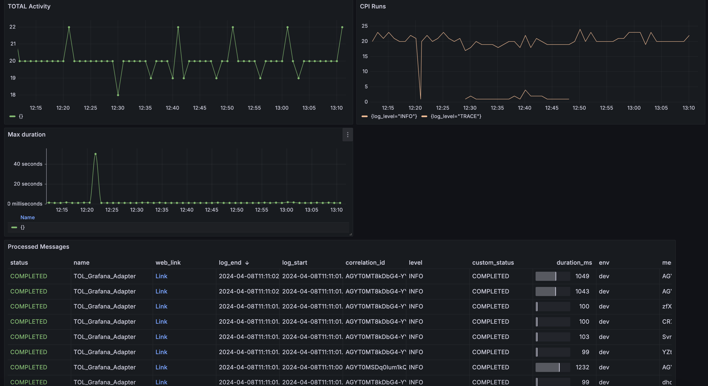
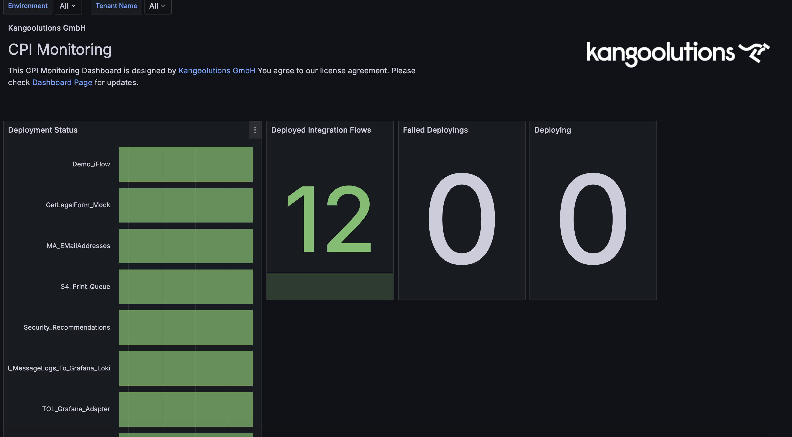

| [README](README.md) | [Whats new?](whats_new.md) | [Getting Started](getting_started.md) | [How to use](how_to_use.md) | [Contribute](contribute.md) |     |
| ------------------- | -------------------------- | ------------------------------------- | --------------------------- | --------------------------- | --- |

# CPI-Grafana-Connect

Integrate your SAP Cloud Integration instance with Grafana Cloud Stack to enhance monitoring and alerting capabilities in SAP Cloud Integration (CPI).

## About the Project

This project aims to develop an enterprise-ready monitoring solution for SAP Cloud Integration (CPI). As the complexity increases, obtaining a clear overview becomes more challenging. Relying on custom solutions within integration flows may not be optimal for mission-critical applications. This project strives to elevate monitoring to a new level and break free from conventional patterns. It is published as open source so everyone can participate.

To get this all working, logs and metrics are send to Grafana Cloud to feed dashboards.

## About the Author

Kangoolutions GmbH Germany is a fast moving consulting company in the field of SAP Integration and SAP Integration Suite. We want to provide modern solutions for modern companies.
If you have special needs or you need an implementation partner for SAP Cloud Integration and Monitoring (also connected to your S4), feel free to contact us on [kangoolutions.com](https://kangoolutions.com) or on linkedin.

## Additional Monitoring your SAP ERP

The Grafana stack comes with great benefits to get insights to your SAP ERP. Talk to our experts to get a first overview.

TODO Link.

## Impressions

### See All your Messages

### See All your Integration Flows

## Getting started

Please visit our [getting started](getting_started.md) page.

## How to Contribute

If you have experience with SAP CPI, Grafana Loki, or Tempo, we invite you to contribute to this project. Your contributions can range from providing feedback and suggestions for enhancements to submitting code changes that help enhance the monitoring solution.

## Why Choose Grafana Cloud?

Grafana Cloud provides an enterprise-ready observability platform based on the open source Grafana stack.

- Offers a free forever version
- Maintains high security standards ([security compliance](https://grafana.com/legal/security-compliance/))
- Actively contributes to open source projects
- Features a user-friendly and effective product

### Out-of-the-Box Features

- Ability to send logs, metrics, and traces
- Alerting based on defined rules (Grafana Cloud default feature)
- Synthetic Monitoring for checking availability (Grafana Cloud default feature)
- Advanced visualization and querying capabilities
- Performance testing with K6 (Grafana Cloud default feature)

## Additional Features

### Planned for Version 1.0.0

- Integration Flow within CPI for sending information about messages and deployed Integration Flows
- Dashboard providing a basic overview of messages
- Dashboard offering an overview of deployed Integration Flows

### Backlog

- Sending logs to Grafana Loki using ProcessDirect adapter via the provided Integration Flow
- Sending logs to Grafana Mimir using ProcessDirect adapter via the provided Integration Flow
- Providing Groovy Scripts to handle traceparent headers for tracing
- Sending traces to Grafana Tempo
