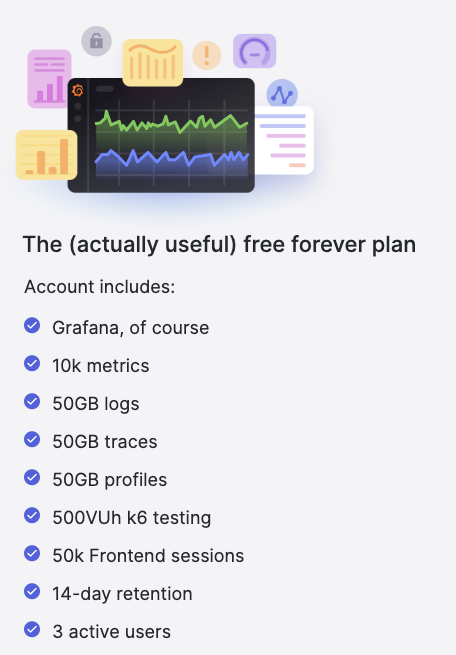
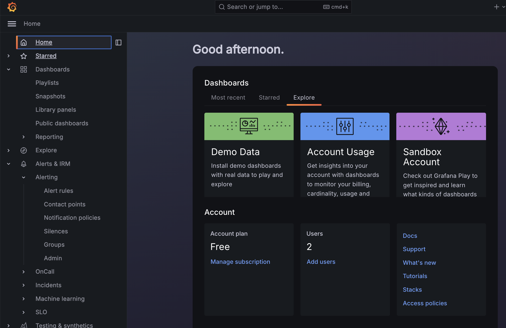
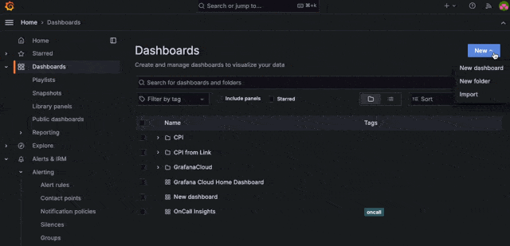
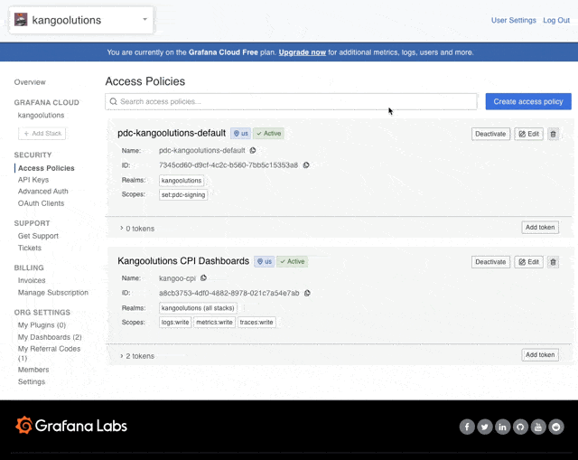
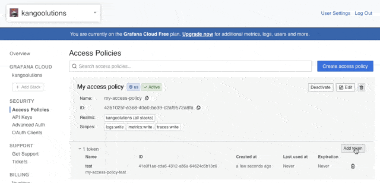
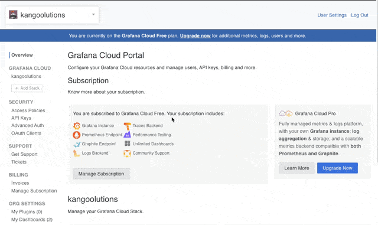

# Getting started and initial setup

Time needed: 30 minutes

# Prerequisits

- You need permissions to create instances for "Process Integration Runtime" with plan "api" on your SAP BTP Subaccount on which your CPI is running
- You need permissions to import packages, deploy artifacts and create security artifacts on cpi. Developer or Admin should work

# Steps

1. Create a Grafana Cloud Account
2. Create Folder and import dashboards in Grafana Cloud
3. Collect credentials und urls from Grafana Cloud
4. Import Integration Flow to SAP Cloud Integration
5. Create api instance on BTP and collect credentials
6. Create credentials artifacts on Cloud Integration and configure Integration Flow
7. Configure the log and metric collecting Integration Flow and deploy
8. Have fun :-)
9. Give feedback

## 1. Create Grafana Cloud Account

The Grafana Cloud Account is free in its basic version for up to 3 users and a sufficient amount of logs and metrics for this project. Be aware, that retention time is only 14 days.

1. Go to [www.grafana.com](https://grafana.com/auth/sign-up/create-user) and create a new account.

There are 2 different parts of your new account. Your Grafana Instance where you see dashboards and the Account Management.

### URL Structure

**Grafana Instance**: https://yourgrafanatenantname.grafana.net
Used to see/explore your data and dashboards

Looks like this:

**Account Management**: https://grafana.com/orgs/yourgrafanatenantname
Used to get credentials and invite users

Looks like this:

## 2. Create Folder for Dashboard and import Dashboards from file

1. In your Grafana Instance (https://yourgrafanatenantname.grafana.net), go to Dashboards and create a new Folder for the new dashboards that we will import. We called it "Kangoolutions Cloud Integration Monitor".
   
2. Import the dashboards by clicking Import -> Dashboard. You can use id 20662 and 20742 or download the dashboards as json from the main branch --> Grafana Dashboards

## 3. Collect Credentials from Grafana Cloud

In order to send logs and metrics to Grafana cloud, we need to collect/create following data.

A. Access Policy with access token to logs and metrics
Grafana Loki
B. Username
C. URL
Influx (for importing metrics)
D. Username
E. URL

It might me helpful to copy this list and write it together with the credentials/urls to a editor/notepad

You need to do this in your Account Management (https://grafana.com/orgs/yourgrafanatenantname)

1. First we need to create an access policy artifact + create the first token. You can do this in the account management.
   Click on Security --> Access Policies --> Create Access Policy.
   Important is only, that you give write access to logs, metrics and traces (not yet used but maybe later).
   
2. Create a token by clicking "Add token" on your new access policy. Remember the created token. We will reference it with (A)
   

3. Now we need to get the user and URL for Loki. To get this, go back to the account management page and click on Loki. Here you can see username (B) and loki url (C).
   

4. Next part is the URL and username for metrics. Again in the account management, click Influx and note username (D) and url (E).
   

## 4. Import Integration Flow to SAP Cloud Integration

Download the package from the git repository (main branch --> Packages) and import it to your Cloud Integration Tenant

## 5. Create api instance on BTP and collect credentials

1. In order to read message logs etc. from Cloud Integration, you need to have access to the underlying BTP tenant and subaccount (the one where your Cloud Integration runs.). Please activate an instance with the name "Process Integration Runtime" with plan "api" on your BTP subaccount.

It needs the following permissions:

<<>>

2. Create a key pair.

3. Note clientid, client secret and token url.

## 6. Create credentials artifacts on Cloud Integration and configure Integration Flow

Now we need to connect the Integration Flow from the package in step 4 with the Grafana Cloud account. Check the reference to the list in step 3.

1. Create a client credentials secret with the Loki credentials (Username (B) and Token (A)). Remember the name of the artifact. We recommend "".
1. Create a client credentials secret with the Influx credentials (Username (D) and Token (A)). Remember the name of the artifact. We recommend "".
1. Create a Client Credentials artifact with clientid, clientsecret and token url from 5. Remember the name of the artifact. We recommend "".

## 7. Configure the log and metric collecting Integration Flow and deploy

The last step is to configure the Integration Flow "" in the package "" from step 4.

Please check the following values are configured.

Position | -- Name -- | -- Description -- | Example value -|

## 8. Run it.

Congratulations! If you go back to your dashboard in Grafana Cloud, you will hopefully see data.

You can connect other Cloud Integrations if you want. Just repeat step 3 to 6 for each instance.

## 9. Give Feedback (and Collaborate?)

It would be nice if you could give us some feedback, how you use our tool. You can send us a message via [LinkedIn](https://www.linkedin.com/in/dominic-beckbauer-515894188/), Github issue etc. to do so.
